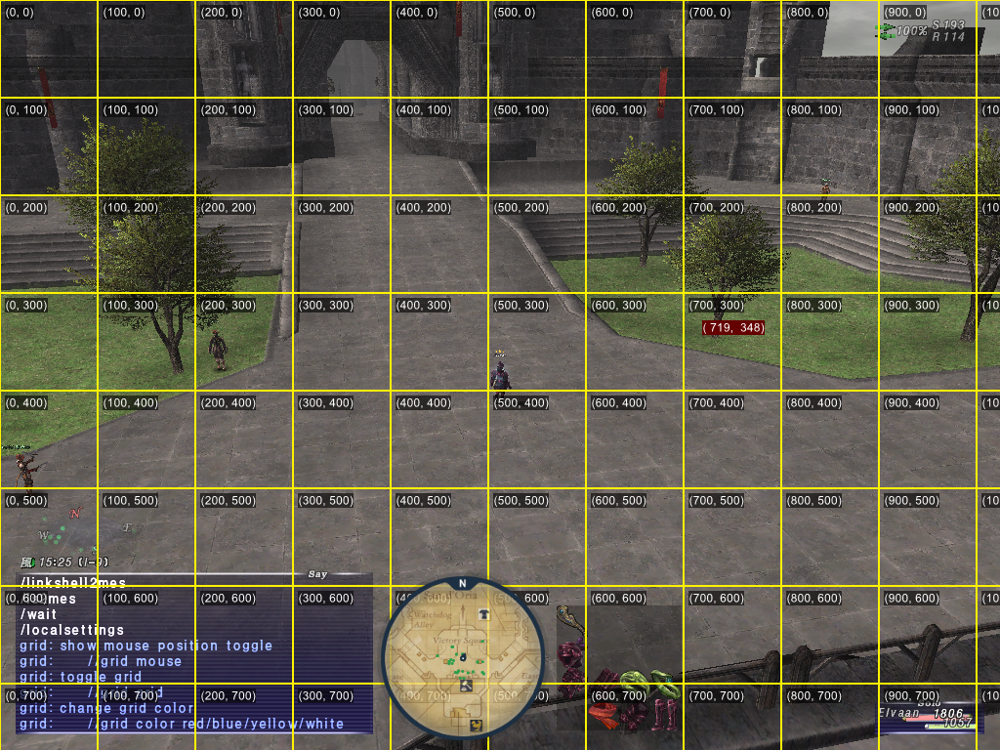

# grid
Display the grid for adjusting the position of the HUD add-on.

# Commands
## toggle mouse position

`//grid mouse`

## toggle grid

`//grid grid`

## change grid color

`//grid color red/blue/yellow/white`